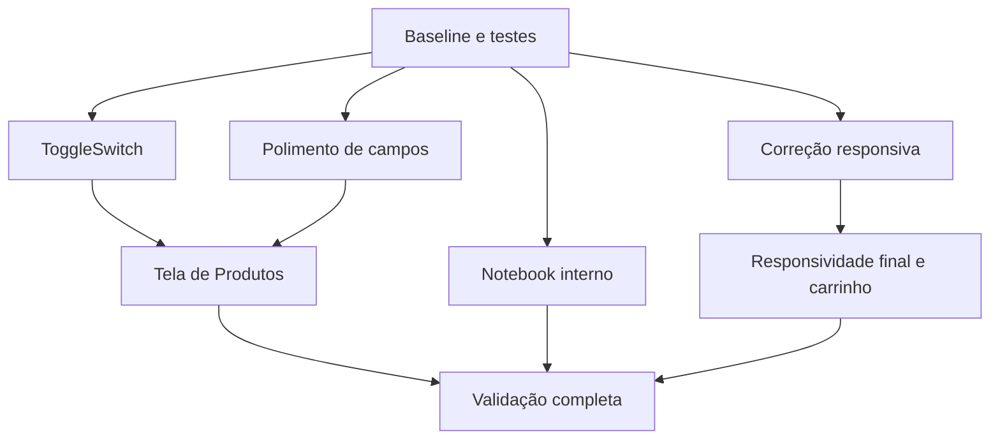

# Plano de refatoração — conferência pré-produção

Documento operacional para implementar melhorias visuais e de responsividade no PDV.

## Regras de execução

- ADRs em `docs/adr/` continuam versionadas.
- Specs, protótipos, validações e arquivos `.scratch/` são artefatos de planejamento e ficam fora do repositório.
- Agentes não fazem `git commit`, `git rm` ou operações de limpeza no worktree compartilhado.
- Cada agente altera somente os arquivos da sua tarefa.
- O commit é feito uma vez, após revisão, testes e inspeção do diff completo.
- Alterações já existentes no worktree devem ser preservadas e revisadas antes de nova edição.

## Estado atual relevante

- `app/ui/components.py`, `estoque/painel.py`, `app/ui/importacao_view.py` e `app/ui/vendas_correcoes_view.py` já possuem alterações locais.
- `estoque/painel.py` já possui ajustes de altura da tabela e ocultação de uma barra de ações duplicada.
- `app/ui/app_window.py` possui referências obsoletas em `_aplicar_compacto_altura()`.
- A suíte depende de `pytest`; instalar/configurar a dependência antes da validação.

## Ordem de implementação



## 1. Baseline e limpeza documental

Antes de implementar:

- revisar o diff atual;
- confirmar que ADRs continuam rastreadas;
- remover do tracking os artefatos de planejamento fora de `docs/adr/`;
- rodar coleta/testes disponíveis;
- registrar falhas de ambiente separadamente de falhas do código.

Não remover `higienizar.py` nem outros scripts sem confirmar uso operacional.

## 2. Correção de responsividade da tela de Venda

Arquivo: `app/ui/app_window.py`.

O método `_aplicar_compacto_altura()` referencia atributos que não são criados por `CaixaApp`:

- `_card_responsavel`
- `_entry_responsavel`
- `_totais_card`
- `_lbl_ajuda`

Corrigir a causa: remover referências obsoletas ou criar os widgets corretamente. `hasattr()` pode ser usado somente como proteção temporária, não como substituto da estrutura correta.

Manter o breakpoint de 760px até medir o layout. Se alterar o valor, validar altura útil de 728px e as transições compacto/não compacto.

Testes mínimos:

- redimensionar abaixo e acima do breakpoint;
- executar os dois caminhos do método;
- confirmar ausência de `AttributeError`;
- confirmar que busca, carrinho e finalização continuam acessíveis.

## 3. ToggleSwitch

Arquivo: `app/ui/components.py`.

Criar componente baseado em `tk.Canvas` com:

- `variable: tk.BooleanVar`;
- `command` sem argumentos;
- `text`, `state`, `get()` e `set()`;
- mouse, Space, Enter e foco de teclado;
- estado disabled;
- animação cancelável com `after_cancel()`;
- atualização de cores quando o tema mudar.

Usar itens Canvas para track, thumb, texto e foco. Adicionar testes de estado, variável, callback, teclado e troca de tema.

## 4. Polimento visual

Arquivos: `tema.py` e `app/ui/components.py`.

- avaliar `surface` contra `surface_3` no tema claro e escuro;
- ajustar `StyledEntry`, `SearchInput`, `TCombobox` e listbox;
- preservar contraste, foco e disabled;
- atualizar testes que validam as cores antigas.

Não alterar somente o valor esperado dos testes: validar também a aparência e os estados interativos.

## 5. Notebook interno sem moldura

Arquivos: `app/ui/components.py` e `app/ui/app_window.py`.

Criar `Inner.TNotebook` usando o layout real disponível no tema `clam`, removendo apenas a moldura externa. Configurar explicitamente tab, selected, active e dark mode.

Validar criação do estilo em Tk real, navegação e troca de tema. Não assumir que `Inner.TNotebook.client` existe como elemento válido.

## 6. Tela de Produtos

Arquivo: `estoque/painel.py`.

Refatorar a construção da tela para:

- KPIs compactos sempre visíveis;
- filtros colapsáveis por controle focável;
- filtros e ações dentro do painel superior;
- tabela no painel inferior;
- divisor ajustável;
- `ToggleSwitch` nos três filtros booleanos.

Como Tkinter não permite reparenting simples, criar os frames com os parents finais desde o início. Não tentar mover widgets já criados com `pack`.

Preservar:

- scroll da Treeview;
- atualização automática dos filtros;
- ações existentes;
- comportamento de estado vazio;
- alterações locais já presentes no arquivo.

## 7. Responsividade final e carrinho

Arquivos: `app/ui/app_window.py` e `estoque/painel.py`.

- validar todas as abas em 1366×768;
- ajustar KPIs somente após medir overflow real;
- otimizar `_renderizar_carrinho()` com cache por `produto_id`;
- atualizar quantidade, subtotal, nome e alerta sem reconstruir linhas quando possível;
- reconstruir somente em adição, remoção ou mudança estrutural;
- limpar cache ao esvaziar o carrinho.

Medir com 10 ou mais itens e confirmar que callbacks não ficam presos a linhas antigas.

## Validação final

```powershell
python -m pytest tests/ -v
```

Também fazer inspeção manual em 1366×768 e em uma janela menor:

- Venda;
- Vendas e correções;
- Estoque e sub-abas;
- Importação;
- Relatórios;
- Configurações/Manutenção.

Só depois da validação completa criar o commit final com mensagem descritiva.
